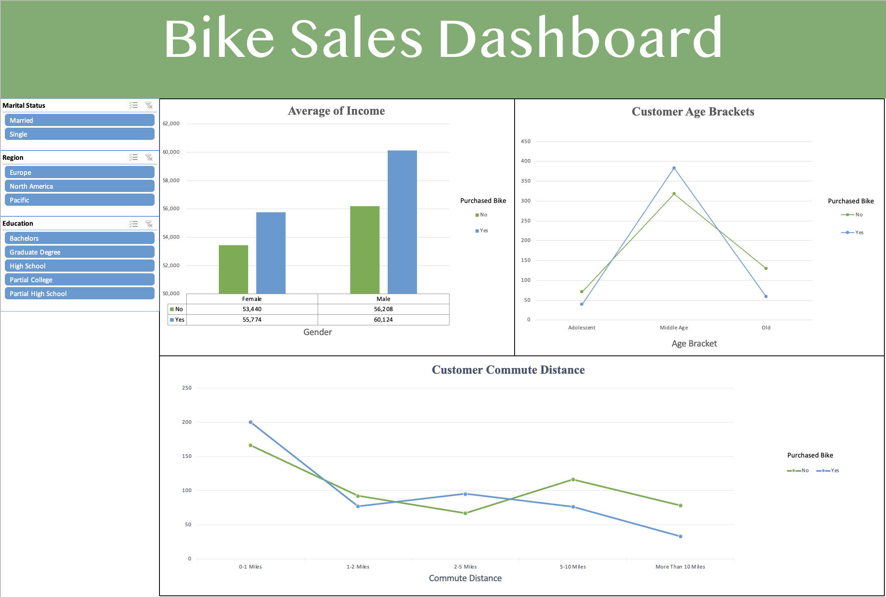

# Bike Sales Dashboard (Excel)

## Overview
This project analyzes bike purchasing behavior using Microsoft Excel. The workflow includes cleaning and transforming raw customer data, building pivot tables, and creating an interactive dashboard to highlight key trends in purchasing decisions.

---

## Data
The dataset contains customer demographic and behavioral variables:
- Marital Status
- Region
- Education
- Gender
- Income
- Age Bracket
- Commute Distance
- Purchase Decision (Yes/No)

---

## Process
- Cleaned and standardized raw dataset
- Created derived fields (age brackets, grouped categories)
- Built pivot tables for aggregation and comparison
- Developed pivot charts for visualization
- Implemented slicers for interactive filtering

---

## Dashboard
The dashboard focuses on three key analyses:

- **Average Income by Gender**
  - Compares income between customers who purchased bikes and those who did not

- **Customer Age Brackets**
  - Examines distribution of purchases across age groups

- **Commute Distance**
  - Analyzes relationship between commute distance and purchase behavior

Slicers enable filtering by marital status, region, and education.

---

## Key Insights
- Higher income customers are more likely to purchase bikes  
- Middle-aged customers represent the largest purchasing segment  
- Shorter commute distances are associated with higher purchase rates  

---

## Skills
- Data Cleaning
- Data Transformation
- Data Analysis
- Data Visualization (Excel)
- Dashboard Design

---

## Dashboard Preview

